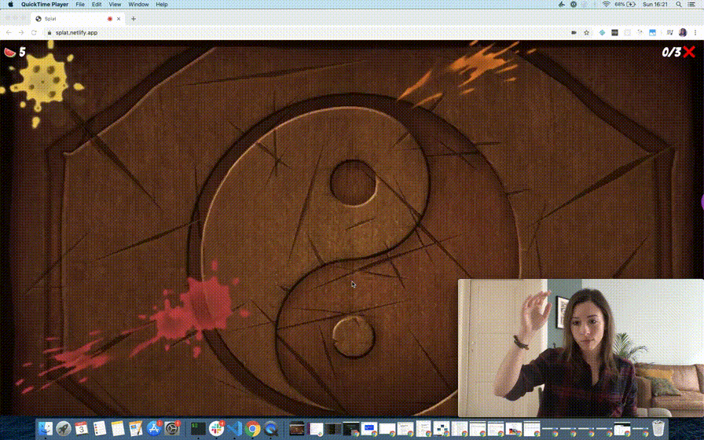

# Splat

Fruit Ninja-y JavaScript motion-controlled 3D game, built with PoseNet and Three.js.

## Demo

## Blog post

[Motion-controlled Fruit Ninja game using Three.js & Tensorflow.js](https://dev.to/devdevcharlie/motion-controlled-fruit-ninja-game-using-three-js-tensorflow-js-18de)
